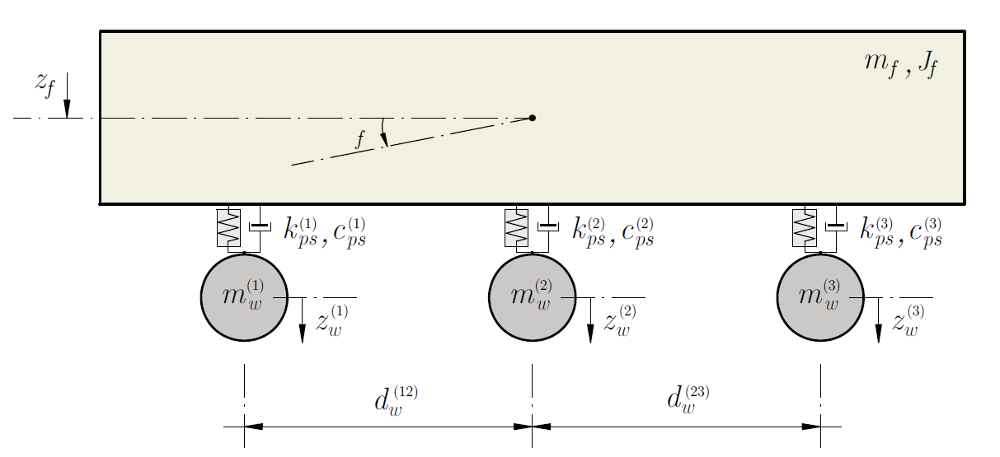

# Dynamic-Behaviour-Landing-Gear
This project aims to study the dynamic behavior of a simplified model of an aircraft when rolling (steady state) when it is circulating stationary on the runway. The roughness of the track is the main exciting agent that will be considered in this project.

## Model

